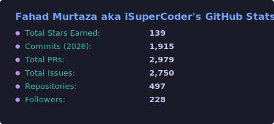

**Founding Principal Engineer at [iSuperCoder](https://isupercoder.com)** · [Toptal Certified](https://www.toptal.com/developers/resume/fahad-murtaza#N0jwP7) · Codeable Expert (2019–2025) · WordPress.org Plugin Author

Full-stack developer with over two decades of shipping production software: commercial WordPress plugins, AI and LLM tools, a Rust microservice platform, cross-platform mobile apps, and developer education projects.

---

## 🧩 TableCrafter - Commercial Plugin Ecosystem

<table>
  <tr>
    <td width="50%">
      <h3><a href="https://tablecrafter.com">TableCrafter ★ WP.org</a></h3>
      
WordPress data tables from Gravity Forms, Google Sheets, Airtable, Notion, JSON, and CSV. Inline editing, filters, bulk operations. <strong>7,900 tests · 98% coverage.</strong>

      

    </td>
    <td width="50%">
      <h3><a href="https://github.com/TableCrafter/tablecrafter.js">TableCrafter.js</a></h3>
      
Zero-dependency vanilla JavaScript data table library, about 27 KB min+gzip. Framework-agnostic and mobile-first, with full parity with the WordPress plugin.

      
        
        
      

    </td>
  </tr>
  <tr>
    <td width="50%">
      <h3><a href="https://wordpress.org/plugins/eventcrafter-visual-timeline/">EventCrafter ★ WP.org</a></h3>
      
Drag-and-drop timeline and roadmap builder for WordPress. Ships with a Gutenberg block, WCAG 2.1 accessibility, API integration, and mobile-first layout.

      

    </td>
    <td width="50%">
      <h3><a href="https://wordpress.org/plugins/cardcrafter-data-grids/">CardCrafter ★ WP.org</a></h3>
      
Transforms JSON data into responsive card grids with Gutenberg block support. Built for team directories, product showcases, and structured data feeds.

      

    </td>
  </tr>
</table>

---

## 🤖 AI & LLM Projects

<table>
  <tr>
    <td width="50%">
      <h3><a href="https://github.com/fahdi/elementor-mcp">Elementor MCP</a></h3>
      
MCP server exposing Elementor's design API to AI agents through 70 tools. Claude, Cursor, and any MCP-compatible client can read and edit page designs.

    </td>
    <td width="50%">
      <h3><a href="https://github.com/fahdi/fahad-ai-shopping-assistant-for-woocommerce">WooCommerce AI Assistant</a></h3>
      
Natural-language shopping for WooCommerce, powered by Claude and Kimi K2. Streaming responses, multi-step tool use, a cart bridge, and Playwright E2E.

      

        
      

    </td>
  </tr>
  <tr>
    <td width="50%">
      <h3><a href="https://github.com/fahdi/wordpress-rag-chatbot">WordPress RAG Chatbot</a></h3>
      
Retrieval pipeline built on FastAPI, LangChain, GPT-4, and Pinecone. Answers WordPress hook questions with cited code samples and 80%+ test coverage.

    </td>
    <td width="50%">
      <h3><a href="https://github.com/fahdi/stenodrop">StenoDrop</a></h3>
      
Free offline batch audio transcription for Mac, Windows, and Linux. On-device Whisper turns folders of audio into .txt, with Urdu to English built in.

    </td>
  </tr>
  <tr>
    <td width="50%">
      <h3><a href="https://github.com/fahdi/ai-forecasting">AI Stock Forecasting</a></h3>
      
Multi-model ensemble combining XGBoost, LSTM, TFT, LightGBM, and CatBoost. Served via FastAPI and Celery with a React dashboard and Google Sheets plugin.

    </td>
    <td width="50%">
      <h3><a href="https://github.com/fahdi/yt-summarizer-api">YouTube Summariser API</a></h3>
      
Flask microservice turning YouTube transcripts into Claude 3 Haiku summaries through the Anthropic SDK. Fully Dockerised, tested, and ready to deploy.

    </td>
  </tr>
</table>

---

## ⚙️ iSuperCoder Platform: Rust Microservice Migration

Replacing Node.js services with Rust (Axum), one service at a time. Gains below are measured against the original Node.js implementations:

| Service | Gain vs Node.js | Tech |
|---------|----------------|------|
| **auth-service** (private) | 3× faster login · 5× concurrency · 70% less memory | Rust · Axum · JWT |
| **file-management** (private) | 500×+ throughput · Google Drive · security scanning | Rust · Axum · MongoDB · Redis |
| **utilities-forms** (private) | Sub-100ms · PDF gen · image processing · URL shortening | Rust · Axum |

Infrastructure: Docker blue-green deployments · Nginx · Let's Encrypt · MongoDB + Redis · GitHub Actions CI/CD

---

## 🔌 Selected Client Work

| Project | What I Built |
|---------|-------------|
| **AJS Trucking** | 5-repo engagement: JupiterX child theme, Gravity Forms date migration, driver dropdown add-on, admin toolkit, date-fix script |
| **HandballStatz** | Excel importer for SportsPress covering matches, players, teams, and standings, with duplicate prevention via PHPSpreadsheet |
| **Beasley Dashboards** | Role-based WordPress dashboard fed by Google Sheets, with AJAX refresh, Tippy.js tooltips, and nonce security |
| **Buddyboss / PMPro** | Gumroad webhook sync into PMPro memberships for BuddyBoss: new user creation, tier mapping, cancellation |
| **AusBeds** | Distance-based shipping calculator using Google Maps Geocoding + Distance Matrix APIs |

---

## 📱 Mobile Apps

<table>
  <tr>
    <td width="50%">
      <h3><a href="https://github.com/fahdi/rakat-counter-native">Rakat Counter Native</a></h3>
      
Zero-touch prayer counter that solves the "Prayer Mat Paradox" with hybrid 60 Hz accelerometer and audio metering. Built with React Native and Expo.

    </td>
    <td width="50%">
      <h3><a href="https://github.com/fahdi/duplicate-music-finder">Dedupe</a></h3>
      
macOS duplicate music finder built with SwiftUI. FFT spectral analysis via Apple Accelerate plus Chromaprint fingerprinting, with in-app audio preview.

    </td>
  </tr>
</table>

---

## 🛠️ Tech Stack

#### Languages

#### Frameworks & Platforms

#### AI / LLM

#### Tools & Infrastructure

---

## 🎓 Educational Projects

| Resource | Description |
|----------|-------------|
| [Algorithms in 60 Days](https://algorithmsin60days.com) | Daily algorithm challenges from beginner to hard |
| [Rust in 90 Days](https://github.com/fahdi/rust-90-days) | 90 lessons and 7 milestone projects, from absolute beginner to expert |
| [1,000 WordPress Tips](https://github.com/fahdi/1000-wordpress-tips) | Curated tips from a WordPress veteran |
| [1,000 PHP Tips](https://github.com/fahdi/1000phptips.com) | Strict typing, security, OOP, performance |
| [1,000 JS Tips](https://github.com/fahdi/1000-js-tips) · [CSS](https://github.com/fahdi/1000-css-tips) · [Python](https://github.com/fahdi/1000-python-tips) | Tip series across the major web languages |
| [Path to Senior Engineer](https://github.com/fahdi/path-to-senior-engineer-handbook) | Curated newsletters, books, courses & communities |
| [181 Educational YouTube Channels](https://github.com/fahdi/educational-youtube-channels) | Free learning resources across 13 categories and 5 languages |

---

## 📊 GitHub Stats

  
  

---

## 📫 Let's Connect

---

*544 repos and counting.*
